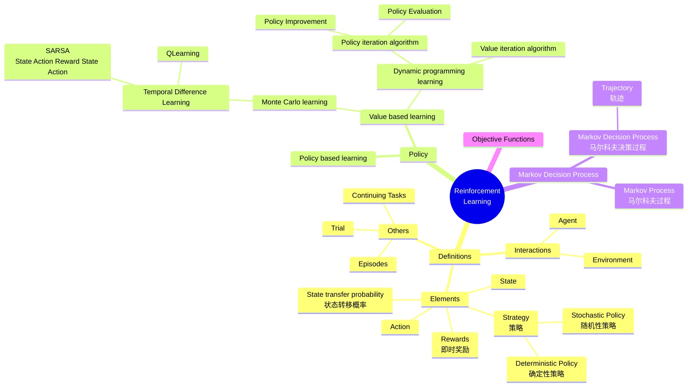

# From DeepSharp

# WIP: English version using Mermaid

## policy
  -  [ ] policy-based learning 基于策略函数的学习方法
  -  [ ] value-based learning 基于值函数的学习方法
       -  [ ] 动态规划学习方法 (Dynamic programming learning)
       - [ ] 蒙特卡罗学习方法 (Monte Carlo learning )
  -  [ ] Others

